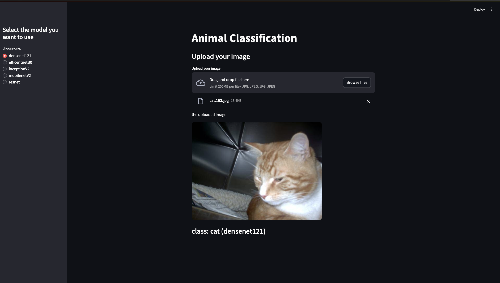

# 🐾 Animal Image Classification Web App

An interactive **animal image classifier** built with **TensorFlow**, **Keras**, and **Streamlit**, capable of classifying images into **Cat**, **Dog**, or **Snake** using multiple pretrained CNN models. Designed for **real-time predictions**, **transfer learning**, and a smooth user experience.

---

## 🚀 Features
✅ **Multiple Models** – Supports multiple architectures including `DenseNet121`, `EfficientNetB0`, `InceptionV3`, `MobileNetV2`, and `ResNet50`.  
✅ **Transfer Learning** – Models pretrained on ImageNet for high accuracy.  
✅ **Fast Predictions** – Performs fast, local inference using `.h5` model files.  
✅ **Streamlit UI** – Simple drag-and-drop image upload and classification.  
✅ **Extensible** – Easy to add new classes or architectures.

---

## 🖥️ Demo Preview
Below is a preview of the web app in action.  


---

## 📂 Project Structure

```plaintext
Animal-Image-Classification-Streamlit/
│
├── animal_classification/         # Trained .h5 models
│   ├── densenet121.h5
│   ├── efficientnet_b0.h5
│   ├── inceptionv3.h5
│   ├── MobileNetV2.h5
│   └── ResNet.h5
│
├── app.py                          # Streamlit app
├── train_densenet121.ipynb         # DenseNet121 training notebook
├── train_resnet.ipynb              # ResNet50 training notebook
├── train_efficientnetb0.ipynb      # EfficientNetB0 training notebook
├── train_inceptionv3.ipynb         # InceptionV3 training notebook
├── train_mobilenetv2.ipynb         # MobileNetV2 training notebook
├── requirements.txt                # Python dependencies
└── README.md                       # Documentation
```

---

## ⚙️ Installation & Setup
1️⃣ **Clone the repository**
```bash
git clone https://github.com/shameel0505/Animal-Image-Classification-Streamlit.git
cd Animal-Image-Classification-Streamlit
```
2️⃣ **Install dependencies**
```bash
pip install -r requirements.txt
```
3️⃣ **Run the app**
```bash
streamlit run app.py
```
